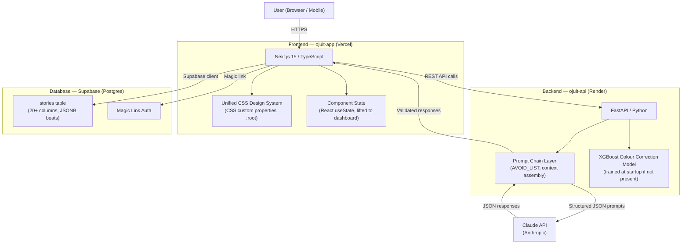

# Ojuit

**AI filmmaking intelligence for solo indie filmmakers.**

Ojuit is a two-product AI platform that helps solo indie filmmakers develop stronger stories and maintain consistent colour across their shoots. The name comes from Yoruba: Ojú (eye, vision) — the eye that sees the story clearly.

Live demo: [ojuit.vercel.app](https://chromasync-app.vercel.app)  
Portfolio case study: [View full case study](https://your-portfolio-url.com/projects/ojuit)  
API repository: [ojuit-api](https://github.com/aiirveon/chromasync-api)

---

## Two products. One platform.

### Story Engine

A guided story development tool that takes a filmmaker from a raw idea to a full beat sheet. Not a story generator — a story discovery tool. The AI asks questions. The filmmaker commits answers. The story that emerges belongs entirely to the writer.

Six stages: Cold Open → Interrogation → Logline Forge → Character Forge → Beat Board → Story Bible.

Every answer is saved to Supabase immediately. Every session is resumable from the exact last action.

### Colour Intelligence

A three-module colour pipeline covering pre-shoot, on-shoot, and post correction. Upload a reference frame to get camera settings before you shoot. Upload a live frame on-shoot to check colour drift against the reference in real time. Upload your scenes in post to get per-scene Delta E scores and downloadable LUT files for DaVinci Resolve and Premiere Pro.

---

## System Architecture



---

## Tech Stack

| Layer | Technology |
|---|---|
| Frontend | Next.js 15, TypeScript, Tailwind CSS |
| Backend | FastAPI, Python |
| Database | Supabase (Postgres, Magic Link Auth) |
| AI | Anthropic Claude API |
| ML | XGBoost, scikit-learn, SHAP |
| Computer Vision | OpenCV, NumPy |
| Frontend hosting | Vercel |
| Backend hosting | Render |

---

## Story Engine — how it works

The Story Engine is built around a principle from screenwriting craft: the writer must discover their story, not receive it. Every AI suggestion in Ojuit is grounded in the writer's own committed answers. Nothing is applied to the story without an explicit action from the writer.

**AVOID_LIST injection** — every prompt sent to the Claude API includes a negative constraint list that blocks the most overused AI story defaults: absent parent wounds, chosen one structures, speech-at-the-end resolutions. This prevents AI output monoculture at scale.

**Context-aware suggestions** — every suggestion endpoint receives the full accumulated story state at the point it is called. A suggestion at the beat board uses the logline, theme, interrogation answers, and all prior completed beats. Suggestions become more specific as the story develops.

**Full state persistence** — every committed answer is saved to Supabase immediately. The writer can close the browser at any stage and resume from the exact last action in any future session.

**Four frameworks supported** — Save the Cat (15 beats), Truby Moral Argument (18 beats), Dan Harmon Story Circle (8 beats), Short Story (5 beats).

---

## Colour Intelligence — how it works

**Delta E measurement** — all colour difference calculations use CIE Lab colour space, not RGB Euclidean distance. Lab space is perceptually uniform: equal numerical distances correspond to equal perceived colour differences. Delta E below 5 is the professional continuity threshold.

**XGBoost correction model** — trained on 8,000 synthetic scenes with four drift types: standard, mixed lighting, LOG profile compression, and harsh clipping. Predicts six correction values per scene: R, G, B channel corrections, exposure EV correction, colour temperature correction, and saturation correction. The model trains automatically at API startup if the model file is not present.

**Scene-to-reference LUT generation** — samples the colour distribution of both the scene and reference frames in Lab colour space, fits a degree-2 polynomial mapping from scene Lab values to reference Lab values per channel, and writes a 33x33x33 `.cube` file compatible with DaVinci Resolve and Premiere Pro.

**SHAP explainability** — every correction includes feature importance values so the filmmaker can see which parameter drove the correction.

---

## Colour API Endpoints

| Endpoint | Method | Description |
|---|---|---|
| `/api/pre-shoot/analyse` | POST | Analyse a reference frame, return colour profile and camera settings |
| `/api/on-shoot/compare` | POST | Compare a live frame against a saved reference profile |
| `/api/post-correction/analyse` | POST | Analyse multiple scene frames against a reference, return Delta E per scene and ML correction values |
| `/api/colour/drift` | POST | Compute Delta E between two images in CIE Lab space, return verdict and per-parameter breakdown |
| `/api/colour/lut` | POST | Generate a scene-to-reference correction LUT, return downloadable `.cube` file |

## Story API Endpoints

| Endpoint | Method | Description |
|---|---|---|
| `/api/story/interrogation-hints` | POST | Generate context-aware suggestions for interrogation questions |
| `/api/story/logline` | POST | Generate three logline versions from story context |
| `/api/story/character` | POST | Generate Lie, Want, Need and Save the Cat scenes from wound and logline |
| `/api/story/beat` | POST | Generate a beat-specific question from full story context |
| `/api/story/beat-suggestion` | POST | Generate three beat answer suggestions grounded in all prior beats |
| `/api/story/theme-suggestions` | POST | Generate alternative primal question options |

---

## PM Artefact Suite

Full product documentation is in the `/docs` folder.

| Document | Description |
|---|---|
| [PRD](./docs/PRD.md) | Problem, users, user stories, functional requirements, success metrics |
| [Metrics Framework](./docs/METRICS.md) | North star metric, primary metrics, secondary metrics, counter-metrics |
| [Competitive Analysis](./docs/COMPETITIVE_ANALYSIS.md) | Final Draft, Celtx, ChatGPT, Sudowrite, StudioBinder |
| [Ethics Framework](./docs/ETHICS.md) | AI monoculture, writer over-reliance, sparse input, colour skin tone bias |
| [Risk Register](./docs/RISK_REGISTER.md) | Six risks with likelihood, impact, mitigations, and V2 plans |
| [Architecture](./docs/ARCHITECTURE.md) | System diagram, sequence diagram, key architectural decisions |
| [User Flow](./docs/USER_FLOW.md) | Full user journey with Mermaid flowchart and resume logic |
| [As-Is Process](./docs/AS_IS_PROCESS.md) | Current filmmaker workflow before Ojuit, time costs, pain points |
| [To-Be Process](./docs/TO_BE_PROCESS.md) | Future state workflow with Ojuit integrated, swimlane diagrams |
| [Gap Analysis](./docs/GAP_ANALYSIS.md) | Seven gaps between as-is and to-be, sized and mapped to features |
| [Business Case](./docs/BUSINESS_CASE.md) | Problem sizing, investment required, revenue model, recommendation |
| [Functional Specification](./docs/FUNCTIONAL_SPEC.md) | Exact system behaviour per feature, edge cases, error handling |

---

## Local Development

**Prerequisites:** Node.js 18+, pnpm, Python 3.11+

```bash
# Frontend
cd chromasync-app
pnpm install
pnpm dev

# Backend
cd chromasync-api
python -m venv venv
venv\Scripts\activate        # Windows
pip install -r requirements.txt
uvicorn main:app --reload
```

**Environment variables required:**

Frontend (`.env.local`):
```
NEXT_PUBLIC_API_URL=http://localhost:8000
NEXT_PUBLIC_SUPABASE_URL=your_supabase_url
NEXT_PUBLIC_SUPABASE_ANON_KEY=your_supabase_anon_key
```

Backend (`.env`):
```
ANTHROPIC_API_KEY=your_anthropic_key
```

---

## Design Principles

**AI suggests. Humans decide.** Every AI output in Ojuit is optional. No field is locked. No correction is applied automatically. The filmmaker is always in control.

**Specificity over generation.** The Story Engine is not a story generator. It is a discovery tool. The AI asks better questions than the filmmaker is asking themselves.

**Honest metrics.** Delta E is measured in CIE Lab space because RGB Euclidean distance is not perceptually accurate. A colour correction model that scores R²=0.99 by learning trivial arithmetic is not a model — it is a calculator. Ojuit's model was deliberately redesigned to prevent this.

**Synthetic data is a professional choice.** The colour correction model is trained on synthetic drift data because ground truth corrections are always known exactly with synthetic data. This mirrors production ML practice before expensive real-world labelling.

---

## Built by

Ogbebor Osaheni — AI Product Manager  
[LinkedIn](https://www.linkedin.com/in/osaheni-o-94565421a/) · [GitHub](https://github.com/aiirveon) · osaheniogbebor.c@gmail.com
