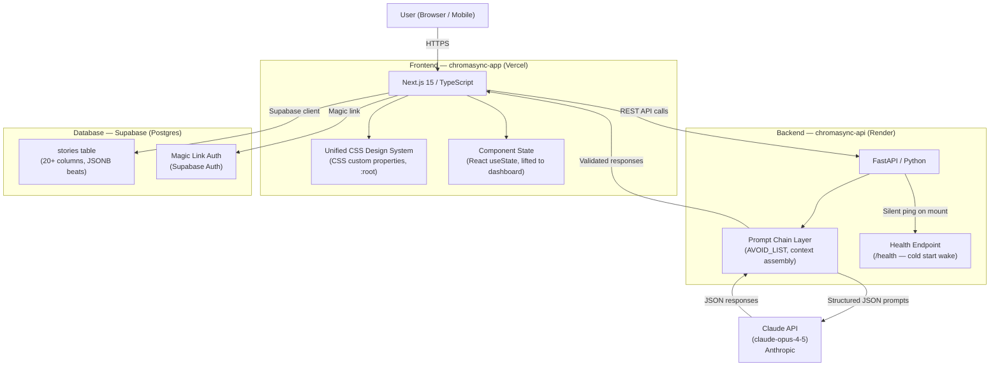
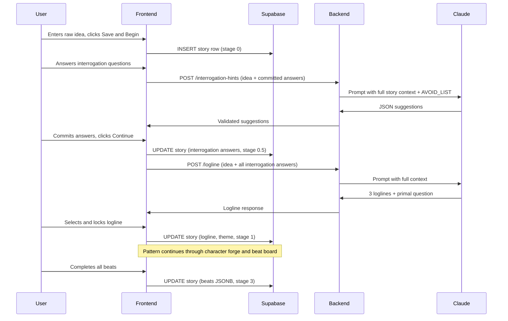

# System Architecture
## ChromaSync
**Author:** Ogbebor Osaheni
**Last Updated:** March 2026

---

## Overview

ChromaSync is a two-product platform built across two repositories and three cloud services. The frontend handles all user interaction and state management. The backend handles all AI prompt orchestration. The database handles persistence and authentication. The three services communicate over HTTPS and are deployed independently.

---

## System Diagram

---

## Services

**Frontend: chromasync-app**
Repository: github.com/aiirveon/chromasync-app
Deployment: Vercel (automatic on push to main)
Stack: Next.js 15, TypeScript, Tailwind CSS, Supabase JS client
Responsibility: All user interaction, component state, CSS design system, routing between story stages, Supabase reads and writes

**Backend: chromasync-api**
Repository: github.com/aiirveon/chromasync-api
Deployment: Render free tier (spins down after inactivity)
Stack: FastAPI, Python, Anthropic SDK
Responsibility: All AI prompt orchestration, AVOID_LIST injection, context assembly per endpoint, JSON response validation

**Database: Supabase**
Project: zgzpaadvnzpbxrvgwvns
Stack: Postgres, Supabase Auth (magic link)
Responsibility: Story persistence, user authentication, row-level security

**AI: Anthropic Claude API**
Model: claude-opus-4-5
Responsibility: Logline generation, interrogation suggestions, character psychology, beat questions and suggestions, theme suggestions

---

## Key Architectural Decisions

**Two-repo separation**
The frontend and backend are separate repositories with separate deployments. This means either can be updated independently without redeploying the other. The backend can be swapped to a paid tier without touching the frontend.

**State lifted to dashboard**
All story state lives in the StoryDashboard component, not inside individual stage components. This means navigating back from character forge to interrogation does not lose any committed answers. Each stage component receives its state as props and writes changes back via callbacks.

**Supabase as the source of truth**
Every user action that commits an answer is saved to Supabase immediately. The frontend never relies on in-memory state surviving a page close. On resume, all state is reconstructed from Supabase and the user is routed to the correct stage.

**AVOID_LIST injection**
A negative constraint list is assembled as a Python string constant and injected into every prompt sent to the Claude API. It is not configurable by the user and cannot be bypassed. It forces the model away from overused story defaults on every single generation call.

**Cold start mitigation**
Render's free tier shuts down the API after inactivity. The frontend sends a silent GET request to /health on component mount to wake the server before the user needs it. The ping fires in the background with no visible UI effect.

**CSS design system**
All visual tokens (colours, spacing, border radius, layout heights) are defined as CSS custom properties in a single :root declaration in globals.css. No component contains hardcoded colour or spacing values. Changing a token in :root updates the entire application.

---

## Data Flow: Story Engine

---

## Environment Variables

**Frontend (Vercel)**
NEXT_PUBLIC_API_URL: URL of the deployed FastAPI backend
NEXT_PUBLIC_SUPABASE_URL: Supabase project URL
NEXT_PUBLIC_SUPABASE_ANON_KEY: Supabase public anon key

**Backend (Render)**
ANTHROPIC_API_KEY: Anthropic API key for Claude access

No secrets are stored in the repository. All environment variables are configured in the Vercel and Render dashboards respectively.
