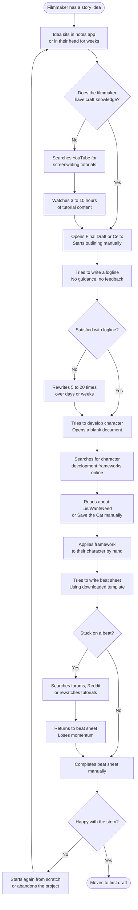
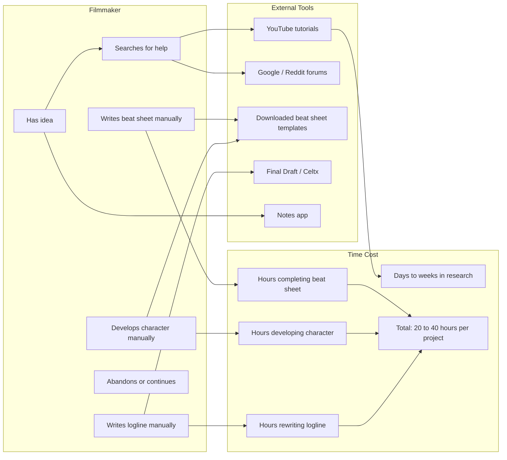

# As-Is Process Documentation
## How Solo Indie Filmmakers Develop Stories Today
**Author:** Ogbebor Osaheni
**Last Updated:** March 2026
**Document Type:** Business Analysis

---

## Purpose

This document captures the current state process a solo indie filmmaker goes through when developing a story idea into a structured screenplay. It is the baseline against which the ChromaSync Story Engine is measured.

---

## Process Overview

---

## Swimlane Diagram

---

## Step by Step Process

### Step 1: Idea capture
The filmmaker has an idea. It may be a title, a feeling, a person, or a situation. They write it down in a notes app, a voice memo, or a physical notebook. There is no structure at this stage. The idea may sit untouched for days, weeks, or months.

**Pain points:** No guidance on what to do with the idea next. No mechanism to develop it while the energy is fresh.

---

### Step 2: Research
When the filmmaker decides to act on the idea, they typically do not know where to start. They search YouTube for screenwriting tutorials, download free beat sheet templates, or join forums like Reddit's screenwriting communities.

**Time cost:** 3 to 10 hours of research before any writing begins.

**Pain points:** Information overload. Tutorials are generic and not connected to their specific idea. The jump from watching a tutorial to applying it is large and unsupported.

---

### Step 3: Logline development
The filmmaker attempts to write a logline. They typically write 5 to 20 drafts over several days. There is no feedback mechanism. They cannot tell if their logline is good because there is no reference point.

**Time cost:** 2 to 8 hours over multiple sessions.

**Pain points:** No way to generate alternatives quickly. No structure to test whether the logline captures the real stakes. Writers with less experience do not know what makes a logline work.

---

### Step 4: Character development
The filmmaker opens a blank document and tries to apply character development frameworks they found during research. They may use a downloaded worksheet or copy a framework from a blog post.

**Time cost:** 3 to 6 hours.

**Pain points:** Frameworks are applied in isolation, not connected to the specific logline the filmmaker has developed. The wound, lie, want, and need are difficult concepts to apply without examples grounded in the filmmaker's own idea.

---

### Step 5: Beat sheet completion
The filmmaker downloads a beat sheet template and tries to fill in each beat. Generic templates give a description of what each beat should accomplish but no guidance on what it means for their specific story.

**Time cost:** 4 to 10 hours. Many filmmakers get stuck on beats 6 through 12 and lose momentum.

**Pain points:** No AI or expert to ask for help on a specific beat. The only option is to search forums or rewatch tutorials. Many filmmakers abandon the project at this stage.

---

### Step 6: Completion or abandonment
Research suggests that the majority of story ideas that reach the beat sheet stage are never completed. The filmmaker either finishes the beat sheet and moves to first draft, or loses momentum and abandons the project.

**Abandonment rate:** Estimated above 60% at the beat board stage based on forum analysis and filmmaker interviews documented in the project research.

---

## Current State Summary

| Dimension | Current State |
|---|---|
| Total time from idea to completed beat sheet | 20 to 40 hours across multiple sessions |
| Tools used | Notes app, YouTube, forums, downloaded templates, Final Draft or Celtx |
| AI assistance available | Generic chat AI (ChatGPT) that writes the story for the filmmaker rather than with them |
| Story specificity | Suggestions and frameworks are generic, not grounded in the filmmaker's own idea |
| State persistence | None. Notes are scattered across apps. Progress is not tracked |
| Resumability | The filmmaker must remember where they stopped and reconstruct context manually |
| Abandonment rate | High. Most ideas that enter the development process do not reach a completed beat sheet |
| Cost | Free tools only. No structured professional development support available at this budget |
