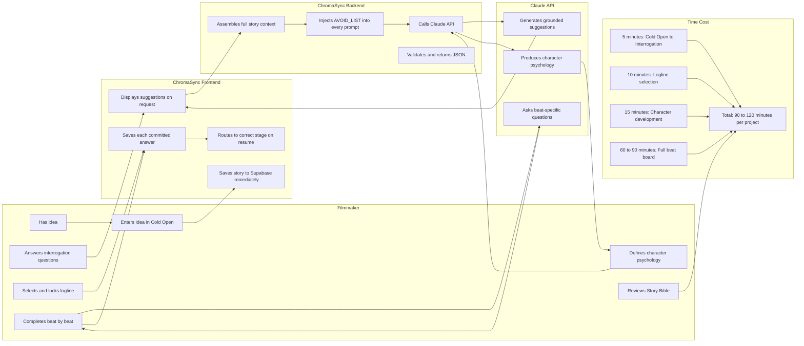

# To-Be Process Documentation
## How Solo Indie Filmmakers Develop Stories With ChromaSync
**Author:** Ogbebor Osaheni
**Last Updated:** March 2026
**Document Type:** Business Analysis

---

## Purpose

This document captures the future state process a solo indie filmmaker goes through when developing a story using the ChromaSync Story Engine. It should be read alongside the As-Is Process document to understand what changes and what stays the same.

---

## Process Overview

```mermaid
flowchart TD
    A([Filmmaker has a story idea]) --> B[Opens ChromaSync\nStory tab]
    B --> C[Cold Open\nTypes raw idea in any form\nTitle, feeling, sentence, or person]
    C --> D[Selects format: Film or Short Story\nSelects framework: Save the Cat, Truby,\nStory Circle, or Short Story]
    D --> E[Clicks Save and Begin\nStory saved to Supabase immediately]
    E --> F[Interrogation Stage\nThree specific questions about\nthe world of the story]
    F --> F1{Optional: Click Suggest\nfor AI location ideas}
    F1 --> F2[Commits answer to Q1]
    F2 --> F3{Optional: Click Suggest\nfor broken relationship ideas\nGrounded in Q1 answer}
    F3 --> F4[Commits answer to Q2]
    F4 --> F5{Optional: Click Suggest\nfor private behaviour ideas\nGrounded in Q1 and Q2}
    F5 --> F6[Commits answer to Q3\nor skips if not ready]
    F6 --> G[Clicks Continue\nAll answers saved to Supabase]
    G --> H[Logline Forge\n3 AI-generated loglines\nGrounded in the filmmaker's own answers]
    H --> H1{Filmmaker action}
    H1 -- Selects a logline --> H2[Logline highlighted]
    H1 -- Edits a logline --> H3[Edit panel opens inline]
    H1 -- Refreshes a logline --> H4[New version generated\navoiding existing ones]
    H1 -- Writes their own --> H5[Custom textarea opens]
    H2 & H3 & H4 & H5 --> H6[Theme field visible\nAI primal question\nEditable by filmmaker]
    H6 --> H7[Optional: Click Suggest\nfor alternative theme questions]
    H7 --> H8[Locks logline\nSaved to Supabase with theme]
    H8 --> I[Character Forge\nWound input grounded in logline]
    I --> I1[Optional: Enter character name]
    I1 --> I2[Describes protagonist wound\nThe formative experience behind the lie]
    I2 --> I3[Submits wound\nSaved to Supabase immediately]
    I3 --> I4[AI generates Lie, Want, Need\nSpecific to this logline and wound]
    I4 --> I5{Filmmaker reviews each field}
    I5 -- Edits inline --> I6[Types custom version]
    I5 -- Refreshes field --> I7[New version generated\nfull context passed to API]
    I6 & I7 --> I8[Two Save the Cat scenes\nActive and Passive options]
    I8 --> I9[Locks one scene\nFull character profile saved to Supabase]
    I9 --> J[Beat Board\nUnlocks first beat]
    J --> J1[AI asks one specific question\nGrounded in logline and character]
    J1 --> J2{Filmmaker action}
    J2 -- Types answer --> J3[Writes in textarea]
    J2 -- Clicks Suggest --> J4[3 suggestions appear\nGrounded in all prior story context]
    J4 --> J5[Clicks suggestion to use it\nOr ignores and writes own]
    J3 & J5 --> J6[Commits beat answer\nSaved to Supabase immediately\nNext beat unlocks]
    J6 --> J7{More beats?}
    J7 -- Yes --> J1
    J7 -- No --> K[Story Complete]
    K --> L([Story Bible\nFull story in one panel\nLogline, theme, character, all beats])

    style A fill:#1a1a1a,color:#f0f0f0
    style K fill:#22c55e,color:#0f0f0f
    style L fill:#f97316,color:#0f0f0f
```

---

## Swimlane Diagram

---

## Step by Step Process

### Step 1: Cold Open
The filmmaker opens ChromaSync and types their idea in any form. A title, a single sentence, a feeling, or a person. They select their format (Film or Short Story) and their framework (Save the Cat, Truby, Story Circle, or Short Story). They click Save and Begin. The story is saved to the database immediately.

**Change from as-is:** The filmmaker does not need to know what to do with their idea. The product tells them the next step. The idea is saved before any work is done so nothing is lost.

---

### Step 2: Interrogation
The platform asks three specific questions about the world of the story. Where does it take place? What relationship was already broken before the story starts? What does the protagonist do when no one is watching? The filmmaker can request AI suggestions for each question. Every suggestion is generated using the answers already committed, so they become more specific with each question.

**Change from as-is:** The filmmaker does not need to research frameworks or watch tutorials. The questions themselves are the framework. Each answer builds on the last. The filmmaker is thinking about their story, not about screenwriting theory.

---

### Step 3: Logline Forge
The platform generates three logline versions grounded in the filmmaker's interrogation answers. The filmmaker can select, edit, refresh, or write their own. A theme field shows the AI's primal question for the story, which the filmmaker can edit or replace.

**Change from as-is:** The filmmaker does not spend 2 to 8 hours writing and rewriting a logline alone. They start with three grounded options and make a choice. The total time is 10 to 20 minutes. The theme question frames the emotional truth of the story before character development begins.

---

### Step 4: Character Forge
The filmmaker enters their protagonist's wound and an optional character name. The platform generates the Lie, Want, and Need specific to that wound and logline. The filmmaker can edit any field or regenerate it with one click. Two Save the Cat scene options are generated and the filmmaker locks one.

**Change from as-is:** The filmmaker does not apply a generic character framework from a downloaded worksheet. Every generated field is connected to their specific logline and wound. The total time is 15 to 30 minutes compared to 3 to 6 hours.

---

### Step 5: Beat Board
The platform asks one specific question per beat, generated from the full story context built so far. The filmmaker answers in their own words. Optional suggestion chips give three concrete examples if they are stuck. Each completed beat is saved immediately. The next beat unlocks automatically.

**Change from as-is:** The filmmaker does not stare at a generic beat description and wonder what it means for their specific story. Each question is written for their story. The momentum is maintained because each beat completion immediately reveals the next.

---

### Step 6: Story Bible
Once all beats are complete, the Story Bible shows the full story the filmmaker has built: logline, theme, character profile (name, wound, lie, want, need, Save the Cat scene), and all completed beats. This is the story development document a filmmaker would take into first draft writing.

**Change from as-is:** The filmmaker has a complete, structured story development document at the end of the process rather than a collection of scattered notes across multiple apps.

---

## To-Be Summary

| Dimension | To-Be State |
|---|---|
| Total time from idea to completed beat sheet | 90 to 120 minutes in a single focused session |
| Tools used | ChromaSync only |
| AI assistance | Context-aware suggestions grounded in the filmmaker's own committed answers |
| Story specificity | Every suggestion is generated from the filmmaker's specific idea, setting, characters, and theme |
| State persistence | Every action saved to Supabase immediately. Nothing is ever lost |
| Resumability | The filmmaker returns to the exact stage and exact state they left. No reconstruction required |
| Abandonment rate | Target reduction through progressive disclosure, incremental unlocking, and grounded suggestions that maintain momentum |
| Cost | Free at current tier. Paid tiers planned for production scale |
