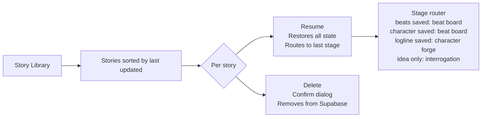
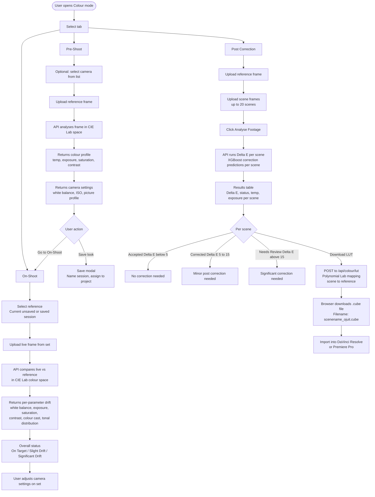

# User Flow
## Ojuit
**Author:** Ogbebor Osaheni
**Last Updated:** March 2026

---

## Overview

The Ojuit Story Engine guides a writer through six stages from a raw idea to a full beat sheet. Every stage unlocks only after the previous one has a committed answer. The writer can leave at any point and resume from exactly where they stopped.

---

## Full User Journey

```mermaid
flowchart TD
    A([User arrives at Ojuit]) --> B{Signed in?}
    B -- No --> C[Magic link auth\nEnter email, click link]
    B -- Yes --> D[Story Mode homepage]
    C --> D

    D --> E{First time or returning?}
    E -- First time --> F[Cold Open\nEnter raw idea]
    E -- Returning --> G[Story Library\nAll saved stories]

    G --> H{Action}
    H -- Resume --> I[Load story state\nfrom Supabase]
    H -- Delete --> J[Confirm delete\nRemove from library]
    H -- New story --> F

    I --> K{Last stage completed}
    K -- Interrogation --> N
    K -- Logline --> Q
    K -- Character --> T
    K -- Beat board --> W

    F --> L[Save modal\nConfirm title, format, framework]
    L --> M[Story saved to Supabase\nstage 0]
    M --> N

    N[Interrogation Stage\n3 progressive questions]
    N --> N1[Q1: Where does this story take place?\nOptional: click Suggest for AI locations]
    N1 --> N2[Q2: What relationship is already broken?\nOptional: click Suggest grounded to Q1 answer]
    N2 --> N3[Q3: What does your protagonist do when no one is watching?\nOptional: click Suggest grounded to Q1 and Q2]
    N3 --> O{Only Q1 required\nContinue?}
    O -- No --> N1
    O -- Yes --> P[Save interrogation answers\nto Supabase]
    P --> Q

    Q[Logline Forge\n3 AI-generated logline options]
    Q --> Q1[View External Stakes version]
    Q --> Q2[View Internal Stakes version]
    Q --> Q3[View Tonal Shift version]
    Q1 & Q2 & Q3 --> Q4{User action per logline}
    Q4 -- Select --> Q5[Highlight logline as chosen]
    Q4 -- Edit --> Q6[Edit panel opens below card\nType custom version]
    Q4 -- Refresh --> Q7[Regenerate this angle\nAvoids existing versions]
    Q --> Q8[Theme field\nAI primal question, editable\nOptional: click Suggest for alternatives]
    Q5 & Q6 --> Q9[Write your own instead?\nOptional collapsible textarea]
    Q8 & Q9 --> Q10{Lock logline}
    Q10 -- No logline selected --> Q1
    Q10 -- Yes --> Q11[Save logline, theme\nto Supabase, stage 1]
    Q11 --> T

    T[Character Forge]
    T --> T1[Enter character name\nOptional]
    T1 --> T2[Enter protagonist wound\nThe formative experience behind the lie]
    T2 --> T3{Optional: Suggest wound ideas}
    T3 --> T4[Submit wound]
    T4 --> T5[AI generates\nLie, Want, Need]
    T5 --> T6{Review character psychology}
    T6 -- Edit field --> T7[Edit inline\nType custom version]
    T6 -- Refresh field --> T8[Regenerate this field\nAll context passed to API]
    T7 & T8 --> T9[Two Save the Cat scene options\nActive and Passive]
    T9 --> T10{Optional: Refresh either scene}
    T10 --> T11[Lock Save the Cat scene\nChoose A or B]
    T11 --> T12[Save character profile\nto Supabase, stage 2]
    T12 --> W

    W[Beat Board\nSave the Cat 15 beats\nTruby 18 beats\nStory Circle 8 beats\nShort Story 5 beats]
    W --> W1[Beat 1 unlocked\nAI question specific to story]
    W1 --> W2{User action}
    W2 -- Type answer --> W3[Write beat answer in textarea]
    W2 -- Get suggestions --> W4[3 AI suggestions\nGrounded in full story context]
    W4 --> W5[Click suggestion to fill textarea]
    W3 & W5 --> W6[Commit beat answer]
    W6 --> W7[Save beat to Supabase immediately\nNext beat unlocks]
    W7 --> W8{More beats remaining?}
    W8 -- Yes --> W9[Next beat\nNew AI question]
    W9 --> W2
    W8 -- No --> X

    X[Story Complete\nAll beats locked]
    X --> Y[Story Bible\nLogline, theme, character profile\nAll 15 beats]

    style A fill:#1a1a1a,color:#f0f0f0
    style X fill:#22c55e,color:#0f0f0f
    style Y fill:#f97316,color:#0f0f0f
```

---

## Stage Summary

| Stage | Name | What the user does | What the AI does |
|---|---|---|---|
| 0 | Cold Open | Writes raw idea, picks format and framework | Nothing yet |
| 0.5 | Interrogation | Answers 3 questions about setting, relationship, behaviour | Suggests options per question on request |
| 1 | Logline Forge | Selects, edits, or writes their logline | Generates 3 versions and a primal question |
| 2 | Character Forge | Describes wound, reviews and edits Lie/Want/Need | Generates character psychology from wound and logline |
| 3 | Beat Board | Answers one question per beat | Asks a specific question per beat, suggests answers on request |
| Complete | Story Bible | Reviews the full story built from their own answers | Displays everything the writer has committed |

---

## Library Flow

---

## Resume Logic

When a user resumes a story, the app reads every column from the Supabase stories table and reconstructs the full state before navigating to the correct stage.

The stage routing follows this priority order. If beats exist in the JSONB column, the user goes to the beat board with completed beats pre-loaded and the cursor on the first incomplete beat. If character_lie exists but no beats, the user goes to the beat board starting from beat 1. If logline exists but no character, the user goes to character forge with the logline pre-populated. If only interrogation answers exist, the user goes to interrogation with their answers pre-filled. A story with only a raw idea resumes at the interrogation stage, not the cold open.

---

## Key UX Decisions

**Only the first interrogation question is required**
This keeps the cold path frictionless. A writer who only knows where their story is set can still proceed. The more they answer, the more grounded the AI suggestions become downstream.

**Suggestions are always requested, never automatic**
No AI output appears unless the writer clicks a suggest button. This ensures the writer is always in the driver seat. The default state of every field is blank and waiting.

**Back navigation does not lose state**
Character forge state is lifted to the dashboard level. Clicking back from character forge to logline forge and then returning does not reset the wound input, character name, or any generated fields.

**Beat board shows completed beats as done**
On resume, previously completed beats are shown with a visual done state. The writer picks up exactly at the first incomplete beat without scrolling through work already done.

**Specificity nudge on Cold Open**
A persistent message below the raw idea textarea is always visible: the more specific the input, the more grounded every downstream suggestion will be. This sets expectations without blocking the user.

---

## Colour Product User Flow

## Colour Product Stage Summary

| Tab | User action | AI output |
|---|---|---|
| Pre-Shoot | Upload reference frame | Colour profile, camera settings recommendations |
| On-Shoot | Upload live frame against reference | Per-parameter drift analysis, overall status |
| Post Correction | Upload reference and up to 20 scenes | Delta E per scene, XGBoost correction values, downloadable LUT |

## LUT Download Flow

The Download LUT button appears in each scene row of the Post Correction results table. On mobile it renders as a full-width button below each scene card. Clicking it sends a POST request to `/api/colour/lut` with the scene file and the reference file. The backend samples colour distributions from both images in Lab space, fits a polynomial mapping per channel, and returns a `.cube` file. The browser triggers a download automatically. The filename uses the scene file name with `_ojuit.cube` appended so the filmmaker knows exactly which scene each LUT corrects.
